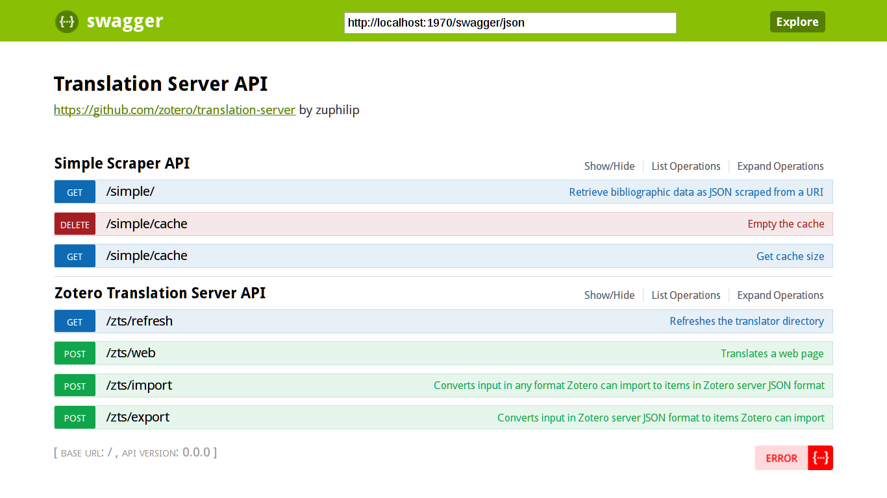

# zts-in-a-box
Zotero Translation Server + Simple Scraping API + Swagger in Docker

[](https://travis-ci.org/kba/zts-in-a-box)

<!-- BEGIN-MARKDOWN-TOC -->
* [Introduction](#introduction)
* [Deployment](#deployment)
* [Configuration](#configuration)
* [Usage](#usage)
* [Note for Windows users](#note-for-windows-users)

<!-- END-MARKDOWN-TOC -->

## Introduction

The aim of this project is to make the [Zotero Translation
Server](https://github.com/zotero/translation-server) easier to deploy and more
comfortable to work with.

The project consists of four components:

* The translation server, packaged as a [Docker image](https://hub.docker/com/r/kbai/zts)
* A small [Node JS server](./src/lib/) that offers a simple API for the use
  case of scraping a website and exporting the results in one go. It also acts
  as a proxy to the translation server and Swagger UI
* An [API user interface](./zts.swagger.yml) that describes the services and
  powers a web site to try out all endpoints, courtesy of [Swagger
  UI](https://hub.docker.com/r/sjeandeaux/docker-swagger-ui)
* The [Zotero translators](https://github.com/zotero/translators), the many,
  many scripts that scrape web pages for bibliographic data and make Zotero so
  versatile. The system is set up to use the [`./translators` Git
  submodule](./translators/) instead of the bundled version of the translators
  that come with translation server. This makes it easier to test script
  problems and allows you to deploy updates as they happen in Github.

## Deployment

There are only two hard requirements for getting zts-in-a-box up and running:

* [Docker](https://docs.docker.com/engine/installation/)
* [Docker Compose](https://docs.docker.com/compose/install/)

Once you have them installed, clone this repository and build the containers:

```sh
git clone --recursive https://github.com/kba/zts-in-a-box
cd zts-in-a-box
docker-compose up
```

This will:

* Pull the Docker images for the translation server and Swagger UI
* Build the Node JS application into a Docker image
* Create a bridge network for those containers to communicate
* Instantiate all images according to the rules in [`docker-compose.yml`](./docker-compose.yml).

Once everything is built and online, stop the containers by pressing `<Ctrl-C>`
and adapt the `docker-compose.yml` configuration.

## Configuration

All configuration happens within the `docker-compose.yml` with the settings
provided to the containers via environment variables.

The most important settings:

* `services.*.ports`: This defines which ports are open to the host.
* `services.zts-simple-api.environment.HOST_AND_PORT`: This defines the
  **external** interface, i.e. the URL you enter into your browser to access
  the app. If you are using Linux, you won't need to change this. If you are
  using Windows or Mac OSX, you must set this to the IP of the virtual machine
  that runs the Docker engine. Whenever the docs refer to `localhost:1970`,
  replace that with the correct host/port combination.
* `services.zts-zimple-api.environment.SIMPLEAPI_CACHE_ENABLED`: Whether or not
  to enable the [cache](./src/lib/cache.coffee) that will cache the results of
  requests by the URL and output format requested.

## Usage

With all configuration finished, start the containers to run persistently in the background:

```sh
cd zts-in-a-box
docker-compose up -d
```

To see what is happening, use the `logs` command of `docker-compose`:

```sh
cd zts-in-a-box
docker-compose logs -f
```

Once they are booted, you can navigate to
[http://localhost:1970](http://localhost:1970) (or whatever you set for
`HOST_AND_PORT`):



You can try all the API endpoints. For example, to get a Bibtex reference from
an online article:

1. Click on [Simple_Scraper_API](http://localhost:1970/#!/Simple_Scraper_API)
2. Click on [GET /simple/](http://localhost:1970/#!/Simple_Scraper_API/get_simple)
3. Set `format` to `bibtex`
4. Choose an interesting article, eg.
   [DOI:10.1016/j.mehy.2009.01.015](http://www.sciencedirect.com/science/article/pii/S0306987709000474)
   and paste its URL into the `url` field.
5. Click `Try it out` and wait a few moments. The bibtex formatted citation should be the `Response Body` field.
6. Click `Try it out` again. It should respond almost instantaneous since the result has been cached.

## Note for Windows users

If the output from `docker-compose` is monochrome and seems garbled, your
terminal emulator does not support ANSI colors. Either use another terminal
emulator or add the `--no-color` flag to all `docker-compose` calls.
